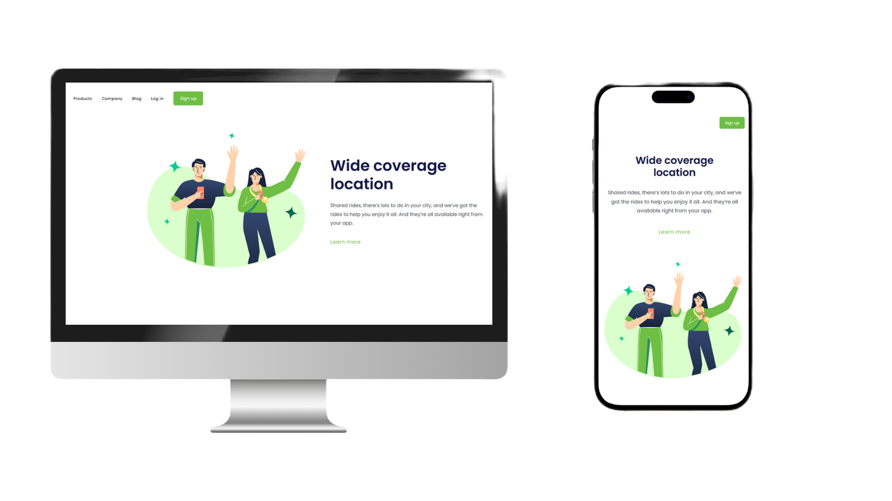

# 🚗 Shared Rides - Landing Page

Este é um projeto de landing page responsiva para um serviço de caronas compartilhadas, com foco em cobertura de localização ampla. Criado como parte de estudos em HTML e CSS modernos.

## 🖥️ Tecnologias utilizadas

- HTML5
- CSS3
- Git e GitHub
- Google Fonts (Poppins)

## 📱 Responsividade

Este projeto foi construído com design responsivo, adaptando-se bem a telas de celular, tablet e desktop.

## 🎯 Funcionalidades

- Navegação visual com menu fictício
- Layout moderno e limpo
- Botões estilizados e imagem ilustrativa
- Design adaptável a diferentes tamanhos de tela

## 💡 Aprendizados

Neste projeto eu:

- Prática com estruturação semântica HTML
- Estilização com CSS moderno
- Uso de `Flexbox` e `media queries` para responsividade
- Organização de código limpo e reutilizável

## 📷 Preview

## 📌 Status

✅ Finalizado.

---

### ✨ Próximos passos

Atualmente continuo estudando **JavaScript** e conciliando os estudos com meu trabalho atual. Novos projetos em breve!

---

## 📬 Contato

Se quiser falar comigo ou acompanhar minha evolução:

- [LinkedIn](https://www.linkedin.com/in/rafael-inui/)
- Email: contato.rafainui@gmail.com
